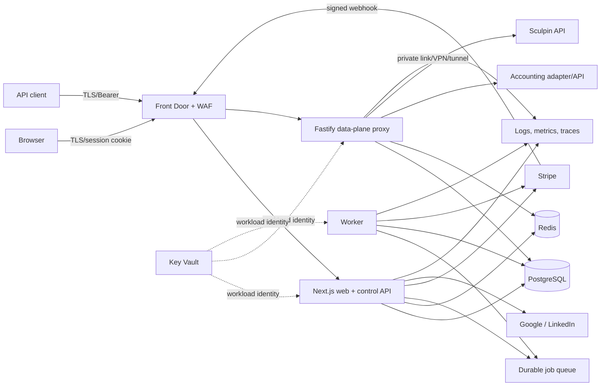
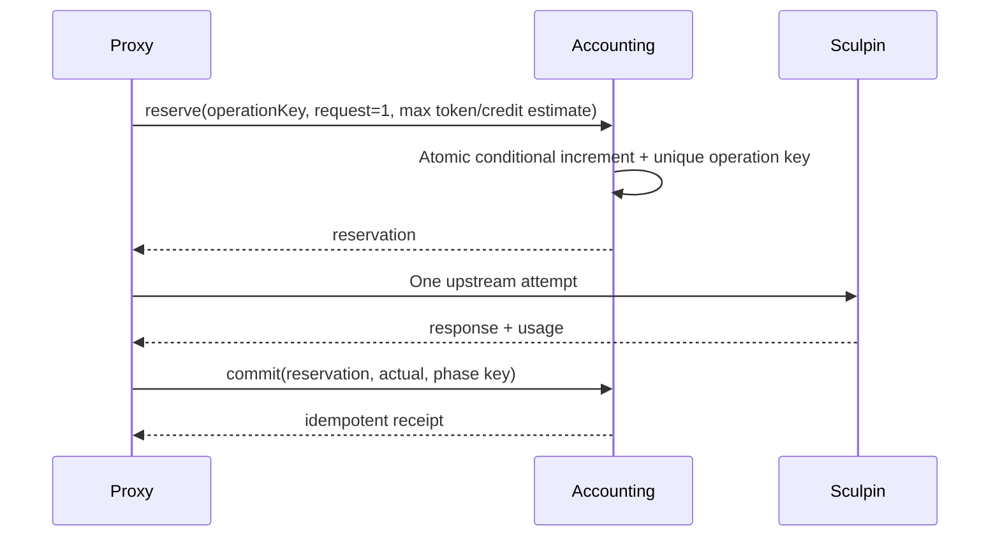
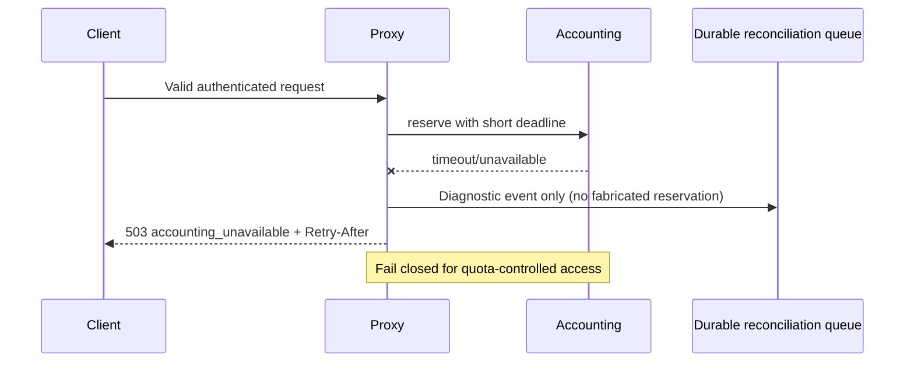
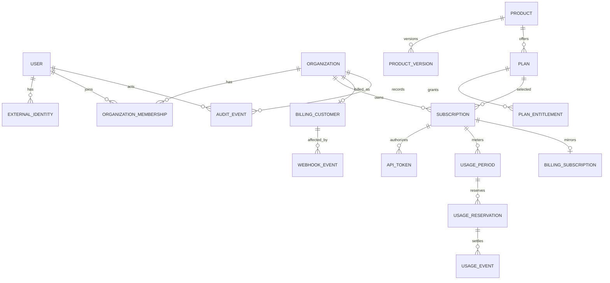

# Sculpin Knowledge Hub: production MVP implementation plan

**Status:** proposed | **Date:** 2026-08-03 | **Audience:** product, security, engineering, operations

## 1. Executive summary

This repository is a planning-only skeleton: `README.md` is empty and `plan.md` contains the supplied brief; there is no application, API contract, mockup asset, dependency manifest, schema, test, container, infrastructure, or CI workflow. Consequently, no Sculpin endpoint is confirmed and the MVP **must not advertise any `/v1/*` operation until a signed upstream contract and contract fixture confirm it**.

Build a TypeScript monorepo with three independently deployable workloads but only two application codebases initially:

* a Next.js web/control-plane application for catalog, OAuth-backed sessions, dashboard, admin, REST control API, billing webhooks, and background jobs;
* a Fastify data-plane proxy for explicitly registered OpenAI-compatible routes and streaming; and
* a worker process built from the control-plane packages for webhook and reconciliation jobs.

Use PostgreSQL as the durable system of record, Redis for disposable atomic rate/concurrency controls and short-lived caches, Stripe Checkout/Portal for the single paid provider, and adapters for accounting and Sculpin. Deploy separate web, proxy, and worker containers so proxy traffic scales and fails independently. This is a pragmatic modular monolith—not a fleet of business microservices—and domain packages must prevent web/proxy coupling.

The critical correctness rule is **reserve before forward, then commit or release**. The authoritative accounting adapter atomically creates a reservation against a period; an idempotency key identifies the logical request. The proxy never forwards when quota cannot be reserved. Final upstream usage commits the reservation; failures release it; uncertain outcomes are reconciled asynchronously. API tokens use an indexed public identifier plus a 256-bit random secret verified with versioned HMAC-SHA-256 and a secret-manager key. Plaintext is returned once and never persisted.

## 2. Repository assessment

### 2.1 Confirmed inventory

Inspection used `git ls-files`, `find . -maxdepth 2 -type f`, targeted `rg`, and `git log`. The only tracked files are:

| Path | Confirmed content | Disposition |
|---|---|---|
| `README.md` | Empty | Extend with workspace bootstrap/runbook in phase 1. |
| `plan.md` | The product/planning prompt, not an implementation | Retain as source brief; reusable as requirements input only. |
| `.git/` | One initial commit on branch `work`; no remote configured | No code history or deployment conventions to preserve. |

No `AGENTS.md` exists in or above the repository. No attached mockup is present in the filesystem, so visual fidelity cannot be assessed beyond the stated clean SaaS direction.

### 2.2 Capability matrix

| Area | Existing fact | Reuse / extend / replace / missing |
|---|---|---|
| Frontend/backend | None | Missing; establish the proposed workspace. |
| Authentication | None | Missing; integrate an established OAuth/OIDC library. |
| Database/migrations | None | Missing; PostgreSQL + Prisma migrations recommended. |
| API conventions | None | Missing; establish REST JSON and OpenAI error conventions. |
| Configuration | None | Missing; typed environment validation plus secret references. |
| Sculpin integration | None; no upstream docs or fixtures | Missing and blocked at route level pending contract. |
| Accounting/billing | None | Missing; ports/adapters, mock accounting, Stripe. |
| Tests | None | Missing; Vitest, Testcontainers, Playwright, contract fixtures. |
| Containers/deployment | None | Missing; OCI images and Azure IaC. |
| CI/CD | None | Missing; GitHub Actions is a recommendation, not a fact. |

Nothing executable can be reused or extended. Nothing warrants replacement. `plan.md` remains useful as requirements provenance.

### 2.3 Proposed repository layout

```text
apps/web/                 # Next.js pages, BFF/control API, webhooks
apps/proxy/               # Fastify OpenAI-compatible data plane
apps/worker/              # webhook, outbox, reconciliation jobs
packages/db/              # Prisma schema, migrations, repositories
packages/domain/          # state machines, entitlement policy, types
packages/auth/            # Auth.js configuration and authorization helpers
packages/accounting/      # port, HTTP adapter, deterministic fake
packages/sculpin/         # port, HTTP/SSE adapter, contract fixtures
packages/billing/         # Stripe port/adapter and webhook mapping
packages/observability/   # logging, metrics, trace/redaction policy
packages/config/          # validated configuration contracts
packages/api-contracts/   # Zod/OpenAPI schemas and error catalog
infra/azure/              # Bicep or Terraform (ADR decides one)
docs/adr/                 # accepted architecture decisions
```

Use pnpm workspaces and Turborepo for orchestration, Node.js Active LTS, strict TypeScript, ESLint, Prettier, Zod at untrusted boundaries, Prisma for migrations/querying, Vitest, and Playwright. Pin runtime/toolchain versions and commit the lockfile. Reconsider language/runtime only if Sculpin organizational standards, measured SSE load, or an existing platform mandate emerges.

## 3. Confirmed requirements

The brief confirms social sign-in with Google and LinkedIn; public products; free/paid individual subscriptions; quotas; token lifecycle; dashboard/admin; an OpenAI-compatible gateway to server-credentialed Sculpin; external accounting checks; streaming; auditing; organizations in the model; and production security/operations. Plaintext access tokens and upstream credentials must never be persisted or disclosed.

The repository confirms **no** OpenAI-compatible endpoint, upstream authentication scheme, accounting operation, cloud target, payment currency, visual asset, or organizational engineering standard. Examples in `plan.md` are candidates, not supported routes.

## 4. Assumptions and open questions

| Question | Safe implementation default | Decision owner / gate |
|---|---|---|
| Which Sculpin endpoints and deltas are real? | Route registry empty; enable only after fixture-backed contract certification. | Sculpin API owner; before proxy phase acceptance. |
| Accounting units/contract? | Enforce request count plus a configurable maximum-token reservation; external service authoritative; fail closed. | Product + accounting owner; before production proxy. |
| Azure target? | Design Azure-first but portable OCI/PostgreSQL/Redis interfaces. | Platform owner; before IaC implementation. |
| Tenant owner for MVP? | Create a personal organization at first login; subscriptions owned by it, while team invitations/admin are deferred. | Product; before schema freeze. |
| Billing region, currency, tax, invoices, refunds? | One configured currency; Stripe Tax not enabled until legal approval; manual audited refunds. | Finance/legal; before paid launch. |
| Trials/grace periods? | No trial and no grace by default; support fields/state transitions. | Product/finance. |
| Quota period timezone? | UTC calendar month, with immutable boundaries saved on `UsagePeriod`. | Product/accounting. |
| Upstream topology/credentials? | Private per-environment URL and workload secret; no public Sculpin exposure. | Security/network/Sculpin owner. |
| Prompt retention? | Never log/store payloads; only aggregate usage and diagnostics. | Privacy/legal. |
| LinkedIn/Google provider approval? | Start application registration early; feature remains disabled until approved. | Product/security. |
| UI mockup? | Responsive accessible design tokens; request source file before visual acceptance. | Design. |

**Documentation verification note.** Before implementing identity/billing, engineers must re-verify provider behavior against the current official [Google OIDC documentation](https://developers.google.com/identity/openid-connect/openid-connect), [LinkedIn authorization-code documentation](https://learn.microsoft.com/en-us/linkedin/shared/authentication/authorization-code-flow), [LinkedIn OIDC sign-in documentation](https://learn.microsoft.com/en-us/linkedin/consumer/integrations/self-serve/sign-in-with-linkedin-v2), and [Stripe webhook documentation](https://docs.stripe.com/webhooks). Network access was unavailable while writing this plan, so this plan deliberately does not freeze mutable provider details. Record versions/date and findings in ADRs and contract tests.

## 5. MVP scope

* Accessible landing, public catalog/detail/plan comparison, onboarding, dashboard, usage, billing, settings, token management, and minimal admin.
* Google and LinkedIn Authorization Code sign-in through Auth.js; personal organizations and future-proof membership schema.
* Published public/private products, versions/routes, free and one-currency paid monthly plans (annual fields supported but annual launch is a product decision), entitlements, and subscription lifecycle.
* Stripe Checkout/Portal and verified webhooks; free subscription without card.
* Secure create/list/rename/revoke/delete access tokens with one-time secret display.
* Only Sculpin endpoints proven by contract tests; JSON and SSE where the endpoint supports it.
* Atomic accounting reservation/commit/release, request/rate/concurrency enforcement, reconciliation, audit, observability, and secure Azure-oriented deployment.

Organizations are real tenant boundaries in MVP, but subscriptions are created for a user's personal organization and advanced member administration is hidden.

## 6. Out-of-scope items

Defer enterprise contracts, invitations and complex team administration, SCIM/SAML, custom RBAC, multi-currency/payment providers, advanced invoices/revenue sharing/resellers, analytics warehouse, advanced IP allowlists, user-defined routing, BYO Sculpin credentials, marketplace settlement, custom quota formulas, mobile apps, and prompt history. Do **not** defer tenant checks, secure token handling, accounting concurrency, migrations, tests, backups, observability, or runbooks.

## 7. Recommended architecture



### Responsibilities and authority

* **Web/control plane:** interactive session, tenant-aware CRUD, public reads, admin, checkout/portal initiation, webhook ingress, audit. It never accepts API bearer tokens as dashboard sessions.
* **Proxy/data plane:** narrow route registry, token auth, entitlement snapshot, controls, accounting, Sculpin transport, normalized responses. No catalog mutations or billing logic.
* **Worker:** durable webhook state application, outbox, reservation/billing drift reconciliation, usage rollups, retention. HTTP ingress acknowledges valid stored webhooks quickly.
* **PostgreSQL:** authoritative identity, tenant, product/plan definitions, local subscription projection, tokens, audit/idempotency records. Accounting API is authoritative for usage totals/reservations; Stripe is authoritative for paid billing state; webhook-derived local projections reconcile against both.
* **Redis:** non-authoritative rate/concurrency primitives and short-lived caches. Never the only record of money, quota consumption, token revocation, or jobs.

The proxy and web share versioned packages/contracts, not runtime process state. Separate scaling and network policies justify distinct deployables; one repository and database avoid premature distributed domain ownership.

## 8. Alternative architectures considered

| Option | Benefits | Costs | Decision |
|---|---|---|---|
| Single Next.js deployment including streaming proxy | Fastest bootstrap, one image | Web releases/traffic affect API; weaker timeout/autoscale isolation; SSE less controllable | Reject for production; acceptable only as throwaway prototype, which is not requested. |
| Separate Next.js + Fastify proxy + worker | Isolation without domain microservice explosion; shared TypeScript contracts | Three workloads and careful DB privilege separation | **Recommended.** |
| Many domain microservices | Independent ownership/scale | Transactions, events, operations, and truth drift too complex for MVP | Defer until measured/team needs. |
| Managed API gateway alone as proxy | Strong edge policy | Cannot own full reservation/stream reconciliation semantics; vendor coupling | Use for edge/WAF, not business proxy. |
| PostgreSQL-only limits | Durable, simpler dependency set | Hot-row contention and weak fine-grained rate limiting | Retain durable usage authority but use Redis for ephemeral controls. |
| Auth0/Entra External ID instead of Auth.js | Managed identity posture and admin controls | Cost, vendor setup, customization | Re-evaluate if enterprise identity/MFA policy requires it; Auth.js is default. |

## 9. Trust boundaries and threat model

Trust boundaries are browser↔edge, API client↔proxy, edge↔workloads, workload↔database/Redis, webhook provider↔ingress, workload↔external accounting/Sculpin/IdPs/Stripe, and operator↔admin/secrets. All external data is untrusted. Service identities receive minimum DB schemas/actions and network egress.

### Security controls

| Threat | Required controls / verification |
|---|---|
| Stolen/brute-forced token | 256-bit secret, HMAC verifier, prefix/IP rate limits before DB where possible, expiry/revocation, anomaly metrics; never reveal token existence in errors. |
| Log/trace credential or prompt leakage | Framework-wide redaction of authorization/cookie/provider/payment/upstream headers and bodies; metadata-only logs; canary secret tests. |
| OAuth takeover/link confusion | Library-managed code flow, exact redirect allowlist, state/nonce/PKCE as provider/library supports, issuer/audience checks, explicit linking while reauthenticated; no email-only auto-link. |
| Cross-tenant access/IDOR | Tenant derived from session/token—not request body; repository methods require tenant context; FK ownership checks; negative matrix tests; optional PostgreSQL RLS defense-in-depth. |
| Entitlement/subscription bypass | Central policy function and authoritative projection; signed admin changes; fail closed on uncertainty; cache bounded and invalidated. |
| Replay/duplicate operations | CSRF protections, idempotency keys and unique constraints, webhook event IDs/signatures/timestamp tolerance, transactional outbox. |
| DoS/slow clients/large bodies | WAF/IP limit, header/body/query limits, request/read/write/idle/stream deadlines, concurrency leases, backpressure; do not buffer SSE. |
| SSRF/header injection/open redirect | Compiled route registry and fixed upstream bases; strict header/query allowlists; strip hop-by-hop/CRLF; relative redirect allowlist. |
| Webhook forgery | Verify signature over raw body before parse; endpoint-specific secret; store event ID; async processing and replay window. |
| Accounting races | Atomic reserve, unique logical operation keys, transaction/serializable service semantics, expiring leases and reconciliation. |
| Database compromise | HMAC key absent from DB; encryption at rest, private endpoint, least privilege, PITR, encrypted backups, audit access; minimize PII. |
| Secret exposure | Key Vault/workload identity, no committed secrets, rotation versions, egress policy and secret scans. |
| Admin escalation | Separate platform-admin assignment, MFA-capable IdP policy, reauthentication for sensitive actions, immutable audit trail, no UI-only authorization. |
| Supply chain | Lockfile, provenance/SBOM, Dependabot/Renovate, SAST, secret/dependency/container/IaC scans, signed minimal non-root images. |

Security headers: strict CSP with nonces, HSTS, `nosniff`, restrictive `Referrer-Policy` and `Permissions-Policy`, `frame-ancestors 'none'`; cookie prefixes where practical. TLS 1.2+ externally and TLS to dependencies. Validate schemas and canonical UUIDs. Never log prompts, completions, payment data, cookies, OAuth/access tokens, authorization headers, or Sculpin credentials.

## 10. Authentication and identity design

Use current Auth.js with its database adapter only after phase-1 compatibility verification. Google is OIDC. LinkedIn's current approved OIDC product should be preferred; if the tenant only supports OAuth userinfo, explicitly document scopes/claims and do not manufacture OIDC guarantees.

```mermaid
sequenceDiagram
  actor U as User
  participant W as Web/Auth.js
  participant I as Google or LinkedIn
  participant D as PostgreSQL
  U->>W: Choose provider
  W->>W: Generate state, nonce, PKCE (as applicable)
  W-->>U: Secure transient cookie + redirect
  U->>I: Authorize
  I-->>W: code + state
  W->>W: Validate state; exchange code; validate issuer/audience/nonce
  W->>D: Transaction: identity/user/personal org/membership
  D-->>W: Tenant + role
  W-->>U: Rotate session; Secure HttpOnly SameSite cookie
```

* Exact HTTPS callback URIs are registered per environment; reject dynamic callback hosts and non-allowlisted return paths. Authorization Code flow is mandatory, with PKCE when supported/recommended. Library validates `state`, nonce, issuer, audience, code exchange and token signature.
* Unique identity is `(provider, provider_subject)`. Normalize email for display/search but do not use it as identity. Never auto-link an existing account merely because emails match, even if verified: require a logged-in, recently reauthenticated user to initiate linking and prove both providers. Duplicate verified email yields a generic account-linking prompt; unverified email cannot link.
* Persist provider subject, minimal profile, email and verification status. Do not retain provider access/refresh tokens unless a documented downstream need exists; if needed, envelope-encrypt with Key Vault-managed KEK, restrict columns, rotate, and delete at unlink.
* Store opaque random session identifiers hashed in PostgreSQL; 12-hour idle and 7-day absolute expiry (decision configurable), rotation on sign-in/privilege change, server-side revocation. Cookies: `HttpOnly`, `Secure`, `SameSite=Lax`, path `/`, no broad domain. Apply origin/CSRF-token checks to mutations. Logout revokes server session and clears cookie; provider-wide logout is not implied.
* Deactivation revokes sessions and API tokens, suspends owned personal-tenant subscriptions, and blocks authentication. Platform roles are separate from organization roles; admin actions enforce server authorization and recent auth. Require MFA through the identity/provider policy for production administrators if the chosen identity solution exposes assurance; otherwise adopt a managed admin IdP before launch.

## 11. Product, plan, and subscription design

Products have visibility (`public`, `private`, `unpublished`) and immutable published `ProductVersion`s. A version maps public model aliases to secret upstream route configuration. Clients see aliases/capabilities, never base URLs, agent IDs, headers, or credentials. Plans belong to one product and contain normalized, versioned entitlements rather than arbitrary executable JSON.

### Entitlement ownership

| Business truth | Authoritative component | Local/cache behavior |
|---|---|---|
| Product/plan/entitlement definition | PostgreSQL control plane | Versioned rows; short Redis cache invalidated via outbox/version. |
| Subscription access state | Control-plane projection following verified Stripe/free/admin events | PostgreSQL; proxy uses seconds-long cache keyed by version and rechecks sensitive/revoked state. |
| Paid billing state | Stripe | Webhook projection plus scheduled provider reconciliation. |
| Usage totals/reservations | External accounting service (PostgreSQL reference adapter for local/tests) | Local immutable event mirror/outbox for diagnosis; never overwrite authority blindly. |
| Rate/concurrency state | Redis | Disposable; DB/accounting quota remains backstop. |

Entitlements include `requests_per_period`, input/output/total token or credit limits (nullable means not granted unless explicitly `unlimited`), requests/minute burst, maximum active tokens, maximum concurrent requests, enabled operations/model aliases, and optional trial/grace behavior. Administrative overrides are scoped, bounded, reasoned, expiring rows—not edits to usage history.

Upgrades activate only after authoritative paid confirmation and use newly computed entitlement snapshots. Default downgrade applies next period to prevent mid-period ambiguity; immediate downgrade requires atomic re-evaluation and never refunds automatically. `cancel_at_period_end` is an attribute plus access state, not an independent contradictory truth. Past due denies proxy by default after a configurable, explicitly approved grace deadline; suspended always denies.

## 12. API-token security design

Format: `skh_<env>_<public-id>_<secret>`. `<public-id>` is 128-bit random base32/base64url, non-secret, unique, and indexed; `<secret>` is 32 random bytes (256 bits) base64url from the platform CSPRNG. The parser enforces exact alphabet/length and a maximum Authorization header before lookup. Environment prevents accidental cross-environment use; product restriction is stored policy, not trusted from the string.

Store `public_id`, `secret_verifier = HMAC-SHA-256(K_version, canonical_secret)`, `key_version`, safe display prefix/last four, owner/creator, optional subscription/product/scopes, expiry/status/revocation, and coarse last-used time. The HMAC key is versioned in Key Vault, unavailable to DB readers. Compare calculated and stored fixed-size bytes with a constant-time primitive. Machine tokens are uniformly high entropy, so a fast keyed HMAC is preferable to Argon2/bcrypt: slow password hashing mitigates guessable human secrets, while here it needlessly adds authentication DoS cost. The secret manager key also makes a DB dump insufficient.

Creation occurs in one request: generate in application memory, store only verifier, return full token in a response marked `Cache-Control: no-store`, then clear references. The UI displays it in a nonpersistent modal; never local/session storage, telemetry, URL, email, or retry payload. Listing returns metadata only. Rename is audited. Revoke is monotonic and immediate in PostgreSQL plus pub/sub/cache eviction; proxy positive-cache TTL must meet the revocation SLO. Delete is soft deletion after revoke, retaining verifier/audit metadata for 90 days (legal decision) and then purging. `last_used_at` is asynchronously/coarsely updated to avoid a write per request.

Rotation accepts current and previous HMAC key versions during a bounded migration. A background job recomputes verifiers only if it possesses the plaintext—which it never does—therefore existing records keep their recorded old key until token expiry/revocation; retire an old key only after all associated tokens expire/revoke or require token replacement. Never overwrite a verifier with a new key without the secret.

### Token creation sequence

```mermaid
sequenceDiagram
  actor U as User
  participant W as Control API
  participant D as PostgreSQL
  participant A as Audit/outbox
  U->>W: POST /api/v1/tokens (CSRF + Idempotency-Key)
  W->>W: Authorize tenant; enforce max active tokens
  W->>W: CSPRNG public ID + 256-bit secret; HMAC using Key Vault key
  W->>D: Transaction: verifier metadata + idempotency response marker
  W->>A: Token-created event (no secret)
  W-->>U: 201 full token once; Cache-Control: no-store
  Note over W,D: Retries never reproduce or retrieve plaintext; return conflict/metadata
```

Tests inspect DB/log/span/browser artifacts, prove a verifier is not a bearer credential, assert constant indexed lookup (`EXPLAIN` at scale), cross-product denial, one-time response, prompt revocation across instances, invalid-format short circuit, and key-version behavior.

## 13. Accounting and metering design

Define a provider-neutral port:

```ts
interface AccountingPort {
  resolveEntitlement(subject, product, period): Promise<EntitlementSnapshot>;
  reserve(command: { operationKey; estimatedUnits; expiresAt }): Promise<Reservation>;
  commit(command: { operationKey; reservationId; actualUnits }): Promise<UsageReceipt>;
  release(command: { operationKey; reservationId; reason }): Promise<void>;
  getSummary(subject, product, period): Promise<UsageSummary>;
}
```

`operationKey = HMAC(accounting-idempotency-key, tenantId || tokenId || clientIdempotencyKey-or-requestId || operation || periodStart)`. Reserve/commit/release each also have a distinct phase key. Do not forward raw access tokens. Adapter requests have deadlines, mTLS/service authentication, correlation IDs, schema validation, retry with exponential jitter only for idempotent operations, and a circuit breaker.

The `reserve` operation—not `check` followed by decrement—atomically verifies entitlement and increments reserved units under a single accounting transaction/conditional update. It returns the same reservation for duplicate keys. For a combined quota, reserve one request plus the endpoint's validated `max_tokens`/configured worst-case credit. Commit replaces reservation with actual input/output/total tokens and product credits; unused capacity is released. If upstream provides no trustworthy token usage, commit the conservative reservation and flag `estimated=true`; a later authoritative usage report may adjust through a compensating event, never mutation.



```mermaid
sequenceDiagram
  participant P as Proxy
  participant A as Accounting
  P->>A: reserve(...)
  A-->>P: quota_exceeded
  P-->>P: Release Redis concurrency lease
  P-->>P: Return OpenAI-style 429; no upstream call
```



### Failure modes

| Failure/race | Behavior |
|---|---|
| Concurrent final quota | Accounting atomic conditional reservation gives capacity to at most allowed requests; others receive 429. |
| Reserve timeout with unknown outcome | Do not forward; retry reserve with same key or query it; reservation expires; reconcile. |
| Temporary accounting outage | Fail closed with 503 and bounded `Retry-After`; no Redis-only allowance unless a separately approved capped emergency budget exists. |
| Duplicate client/proxy operation | Same operation key returns same reservation/receipt; only one upstream attempt within this proxy lifecycle. |
| Upstream safe retry | Default no automatic POST retry. If contract proves idempotency, reuse both upstream and accounting keys and bounded retry before any response bytes. |
| Client disconnect/timeout | Abort upstream; release if known no billable work, otherwise commit observed/conservative usage and reconcile. |
| Streaming | Lease remains; accumulate trusted terminal usage; commit at terminal event; on disconnect apply uncertain-outcome policy. |
| Commit/release outage | Durable outbox item retries same phase key; reservation remains counted until reconciled/expired. |
| Reservation expiration | Accounting sweeper marks expired only after lease; proxy heartbeat is optional for long streams; never expire active stream without policy. |

Provide a deterministic PostgreSQL-backed fake/reference service with injected clock/failure scripts for local and CI use—not an in-memory production fallback. Decide the exact accounting units, maximum reservation algorithm, adjustment semantics, and whether Sculpin terminal usage is authoritative before production.

## 14. OpenAI-compatible proxy design

The public route registry begins empty. Candidate routes (`GET /v1/models`, `POST /v1/chat/completions`, `POST /v1/responses`) are enabled individually only when Sculpin contract evidence identifies path, schema, streaming framing, errors, model routing, and usage. Publish an explicit compatibility matrix; unsupported paths return normalized 404 without implying official OpenAI parity.

Request pipeline: edge cheap IP/header limits → correlation ID → strict method/path/content-type/body schema and size → parse bearer → indexed token lookup/HMAC verification → status/tenant/subscription/route entitlement → Redis rate and concurrency lease → authoritative reservation → fixed Sculpin adapter → response stream → commit/release/outbox → lease release. Error responses never reveal which auth predicate failed.

```mermaid
sequenceDiagram
  participant C as Client
  participant P as Proxy
  participant D as PostgreSQL
  participant R as Redis
  participant A as Accounting
  participant S as Sculpin adapter
  C->>P: POST confirmed /v1 route + Bearer token
  P->>D: Indexed ID lookup; HMAC verify; tenant/subscription/route
  P->>R: Atomic rate check + concurrency lease
  P->>A: Atomic reserve(operation key)
  A-->>P: Reservation
  P->>S: Fixed route, server credential, correlation ID
  S-->>P: JSON + usage
  P->>A: Commit actual usage
  P->>R: Release lease
  P-->>C: OpenAI-compatible response
```

```mermaid
sequenceDiagram
  participant C as Client
  participant P as Proxy
  participant A as Accounting
  participant S as Sculpin
  C->>P: POST confirmed streaming route
  P->>A: Reserve worst-case units
  P->>S: stream=true; AbortSignal
  loop SSE frames
    S-->>P: validated frame
    P-->>C: frame with backpressure
  end
  alt terminal usage
    P->>A: Commit actual usage
  else disconnect/terminal absent
    C-xP: disconnect
    P-xS: abort
    P->>A: Commit conservative/observed units; flag reconcile
  end
```

Limits are endpoint-configured: e.g. initial proposals of 1 MiB request JSON, 16 KiB headers, 8 KiB URL, upstream connect 5 s, first byte 30 s, nonstream total 120 s, stream idle 60 s and absolute 30 min—validate with Sculpin/product owners. Response/body limits and bounded queues prevent memory amplification. Stream directly with backpressure; cancel using `AbortSignal` on disconnect; never retry after response bytes.

Forward only `content-type`, `accept`, a sanitized client request ID when valid, and contract-approved OpenAI headers/query keys. Generate authoritative internal correlation IDs. Strip `Authorization`, cookies, `Host`, forwarding headers, user agent unless needed, and RFC hop-by-hop headers (`Connection` plus its nominated headers, `Keep-Alive`, `Proxy-*`, `TE`, `Trailer`, `Transfer-Encoding`, `Upgrade`). The adapter supplies upstream auth. No caller-provided URL/host/scheme/agent ID; routing is a database ID resolved to a validated configuration selected from allowed environment base URLs.

Redis Lua/functions atomically enforce token and subscription rate windows and concurrency leases. Acquire with TTL/owner, renew long streams, and release by compare-owner. If Redis is unavailable, fail closed for protected proxy requests (503) because rate/concurrency protection is required; accounting still owns quota. Entitlement cache TTL ≤30 seconds, includes version, and invalidates through outbox/pub-sub on revoke/suspend. Token revocation is also checked from PostgreSQL on cache miss and sensitive negative events; fail cache closed if freshness cannot meet SLO.

Circuit breaker is per upstream route/cluster; half-open probes are bounded. Readiness reports inability to serve when required dependencies fail, without exposing details publicly. Horizontal instances are stateless except durable/out-of-process stores.

### Error mapping

All bodies follow the confirmed subset of `{ "error": { "message", "type", "param": null, "code" } }`; do not copy sensitive upstream messages.

| Condition | HTTP | `type` / `code` | Retry |
|---|---:|---|---|
| Missing/malformed/invalid/revoked token | 401 | `invalid_request_error` / `invalid_api_key` | No; generic message, `WWW-Authenticate: Bearer`. |
| Valid token, wrong product/scope | 403 | `permission_error` / `insufficient_permissions` | No. |
| Inactive/suspended subscription | 403 | `permission_error` / `subscription_inactive` | After account resolution. |
| Validation/body too large | 400/413 | `invalid_request_error` / `invalid_request` | Correct request. |
| Unsupported route/model | 404 | `invalid_request_error` / `not_found` | No. |
| Rate/quota/concurrency exhausted | 429 | `rate_limit_error` / specific safe code | At `Retry-After`/next period. |
| Accounting/Redis unavailable | 503 | `api_error` / `service_unavailable` | Yes, bounded jitter. |
| Sculpin timeout/unhealthy | 502/504 | `api_error` / `upstream_error` | Only client decides unless safe contract. |
| Unexpected internal error | 500 | `api_error` / `internal_error` | Maybe; correlation ID only. |

## 15. Sculpin upstream integration

`packages/sculpin` exposes `listModels`, `invoke`, and `invokeStream` only when mapped to confirmed operations. The HTTP implementation owns allowlisted base URL resolution, workload credential injection, route/model alias translation, schema transforms, SSE parsing, deadlines/cancellation, error categorization, health probes, usage extraction, and correlation propagation. Neither route handlers nor database rows can provide arbitrary URLs.

Create sanitized golden fixtures for request/response/errors/SSE, a Sculpin sandbox contract suite, and a compatibility matrix comparing each public field/status/frame with the supported OpenAI contract. Preserve unknown upstream details only in restricted diagnostic categories, not client text. Health checks use a cheap authenticated endpoint agreed with Sculpin; do not generate billable traffic accidentally.

No repository evidence confirms Sculpin endpoints or differences. Phase 0 must obtain an OpenAPI/specification, authentication method, base environments, agent/model identifiers, error/usage formats, streaming termination rules, retry/idempotency behavior, limits, data-processing policy, and connectivity owner. Until then, integration tests use a deterministic stub and public routes stay disabled.

## 16. Data model

All IDs are UUIDv7 (or database-supported time-sortable UUID), timestamps are UTC, mutable rows have `version` for optimistic concurrency, and money uses integer minor units plus ISO currency. Use explicit enums/checks, not magic strings. Every tenant-owned unique/index begins with `organization_id`; repositories require a tenant context. Restrict deletes by default and use explicit retention jobs.



| Entity | Purpose and important fields | Constraints/indexes/FKs | Lifecycle, retention, isolation |
|---|---|---|---|
| `User` | profile, normalized email, status, locale, platform role, deactivated time | unique ID; non-unique normalized email; status index | PII export/delete; tombstone references; platform role guarded/audited. |
| `ExternalIdentity` | provider, subject, email/verified, minimal claims metadata | unique `(provider, subject)`; FK user restrict | Delete on unlink/deletion; encrypted tokens only if exceptional. |
| `Organization` | tenant, slug, type `personal|team`, status | unique slug; owner is membership not loose field | Soft-delete; all access derives tenant here. |
| `OrganizationMembership` | org/user/role/status | unique `(org,user)`; indexes `(user,status)`; cascade only with org purge | Membership history/audit retained; MVP personal owner. |
| `Product` | slug, visibility, name/description, active published version | unique slug; visibility index; version FK restrict | Unpublish, never delete while referenced; global control-plane entity. |
| `ProductVersion` | product, version, public capabilities, encrypted/secret-reference upstream route map, status | unique `(product,version)`; immutable once published | Restrict delete; internal config never serialized publicly. |
| `Plan` | product, code, billing interval, price/currency, status, Stripe price mapping/version | unique `(product,code,version)`; published immutable | Archive instead of delete; mapping changes create version. |
| `PlanEntitlement` | plan, key, typed value/unit, product version/operation scope | unique `(plan,key,scope)`; validated checks | Snapshot onto subscription/period for reproducibility. |
| `Subscription` | org, plan/product, status, provider, period, trial/grace/cancel flags, entitlement version, override | partial unique active `(org,product)`; indexes status/period; restrict FKs | State history/outbox; tenant root; retain per finance policy. |
| `ApiToken` | org/subscription, public ID, verifier, key version, display suffix, scopes/restriction, status/expiry/revoked/last-used | unique public ID; `(org,status)`, `(subscription,status)`; restrict FK | Never plaintext; revoke then soft-delete; purge verifier on policy. |
| `UsagePeriod` | subscription/product, start/end, entitlement snapshot, external ID, aggregates | unique `(subscription,start,end)`; check range; status index | Immutable boundaries; external accounting authoritative; retain billing evidence. |
| `UsageReservation` | period, external reservation/operation key, estimate, status/lease/version | unique operation key and external ID; `(status,expires_at)` | Tenant via period; expire/reconcile; compact after financial retention. |
| `UsageEvent` | reservation/period, phase key, type, actual units, source, estimated, occurred time | unique phase/idempotency key; append-only; period/time index | Immutable accounting evidence; corrections are compensating events. |
| `BillingCustomer` | org, provider, provider customer ID | unique `(provider,provider_id)` and `(org,provider)` | Provider IDs not secrets; retain according to finance/legal. |
| `BillingSubscription` | local subscription, provider ID/status/price, provider event time/version | unique provider ID and subscription; status index | Projection reconciled to Stripe; never authority by browser redirect. |
| `WebhookEvent` | provider event ID/type/created/received, payload hash/encrypted restricted payload pointer, status/attempt/error category | unique `(provider,event_id)`; `(status,next_attempt)` | Verify before insert; minimize/redact payload; retention/replay policy. |
| `AuditEvent` | org, actor, action, target type/ID, safe before/after summary, IP/user agent hash, trace/time | append-only `(org,created_at)`, `(target_type,target_id)` | No secrets/payloads; write via outbox/WORM export; retention ≥1 year pending legal. |

Also add `Session`, `IdempotencyRecord`, `EntitlementOverride`, `SubscriptionTransition`, and transactional `OutboxEvent`. Foreign keys never cascade across financial/audit history; deletion workflows pseudonymize users while retaining legally required non-PII records. Consider PostgreSQL RLS after repository-scoped authorization is tested; workers use explicit elevated roles and log cross-tenant operations.

## 17. API surface

Control plane is `/api/v1`, JSON, session cookie, origin/CSRF protection on mutation, schema validation, tenant context from session. Cursor pagination and stable error envelope `{error:{code,message,requestId,fields?}}`. Mutations accepting retry use `Idempotency-Key` scoped to actor+route+tenant with request hash; a changed body conflicts. Never include secret fields.

| Group/routes | Authn/authz | Request → response; idempotency; expected errors |
|---|---|---|
| `GET /session`, `GET/PATCH /me`, `POST /logout` | Session; `/session` may return anonymous shape; self only | Profile patch allowlist → safe user; logout mutation idempotent. 401, 400, 409. OAuth callbacks remain library routes. |
| `GET /products`, `GET /products/:slug`, `GET /products/:slug/plans` | Public for published; session reveals entitled private products | Filters/cursor → public DTOs only. 404 intentionally masks private objects. |
| `GET/POST /subscriptions`, `GET /subscriptions/:id`, `POST .../cancel`, `POST .../reactivate` | Session + org owner | plan/version and timing → state/period; POST idempotency required. 402/409/422; paid activation stays pending until webhook. |
| `POST /checkout-sessions`, `POST /billing-portal-sessions` | Session + org owner + recent auth | allowlisted plan/return route → short-lived provider URL; idempotent checkout. 409/422/503. Redirect never activates. |
| `GET/POST /tokens`, `PATCH /tokens/:id`, `POST .../revoke`, `DELETE /tokens/:id` | Session + org owner; subscription entitlement | create name/expiry/scopes → full secret once; list/patch never secret; create idempotency has non-replayable response semantics. 403/409/422. |
| `GET /usage`, `GET /usage/periods/:id` | Session + tenant membership | product/period/cursor → aggregate summary. 404 cross-tenant, 503 authority unavailable. |
| `GET /organizations`, `GET /organizations/:id`, `GET /organizations/:id/members` | Session + membership | MVP read-only personal tenant; never accept tenant without membership check. |
| `/admin/products`, `/admin/product-versions`, `/admin/plans`, `/admin/subscriptions`, `/admin/tokens/:id/revoke`, `/admin/usage`, `/admin/audit` | Session + platform admin + recent auth/MFA policy | Versioned CRUD/actions with reason; mutation idempotency and optimistic `If-Match`. 401/403/409/422. |
| `POST /webhooks/stripe` | Stripe signature, raw body; no session | Verify, dedupe/store, enqueue → 2xx only after durable receipt; 400 signature, 5xx storage. |
| `GET /health/live`, `GET /health/ready` | Public minimal status; detailed internal endpoint protected | no input → status/request ID. Liveness never checks dependencies; readiness does. |

Admin list response fields omit verifier/provider payload/upstream secrets/prompt content. Audit export requires explicit authorization and pagination.

### Public data plane

`/v1/<confirmed-route>` uses bearer token, not session/CSRF. Method, schema, supported `stream`, model aliases, errors, limits, and idempotency are route-contract-specific. `/v1/models` must list only models the token's active subscription can invoke and exists only if Sculpin semantics can be represented honestly. Unknown operations are 404. Host a generated compatibility document and OpenAPI subset distinct from the control API.

## 18. State machines

### Subscription

Use `pending`, `trialing`, `active`, `past_due`, `suspended`, `canceled`, `expired`. `cancel_at_period_end` is a boolean/timestamp on `trialing|active|past_due`, avoiding a state that loses access meaning.

| From → to | Owner/trigger | Rule |
|---|---|---|
| none → `pending` | Control plane, checkout/free request | Unique idempotency key; free may transition in same transaction. |
| `pending` → `active`/`trialing` | Free policy or verified Stripe event/query | Never browser redirect; entitlement snapshot stored. |
| `trialing` → `active`/`expired` | Worker/provider/time | Active only if provider confirms where paid. |
| `active` → `past_due` | Verified billing event | Grace deadline explicit; default access denied. |
| any access state → `suspended` | Admin/security automation | Reason/actor required; billing events cannot silently unsuspend. |
| `past_due` → `active` | Verified recovery event | Re-evaluate entitlements, clear grace. |
| `active|trialing|past_due` → same + cancel flag | User/provider | Idempotent; access until period end if eligible. |
| access state → `canceled` | Verified provider/user free cancellation | Immediate denial unless period-end scheduler at boundary. |
| `canceled|trialing` → `expired` | Retention/scheduler | Terminal business expiry; new subscription required. |

Admin unsuspend returns to a separately stored prior/provider-derived eligible state only after rechecking billing. Invalid transitions return 409 and create a safe audit diagnostic. Every transition uses optimistic versioning, unique source event ID, history row, and outbox.

### API token

Persist `active`, `revoked`; `expired` is a derived/eagerly materialized terminal status when `expires_at <= now`. `active → revoked` by owner/admin/security; `active → expired` by clock/job/auth check; no reverse transition. Delete requires terminal state and is a retention marker. Duplicate revoke/expire succeeds without a new semantic transition; conflicting rename after terminal state is 409. Cache eviction/outbox accompanies transition.

### Usage reservation

`reserved → committed|released|expired`. Accounting owns transitions. Commit/release repeat with the same phase key returns the original result. A different terminal transition yields conflict and is investigated; adjustment uses a new compensating `UsageEvent`. Expiry requires `expires_at < authoritative now`, no valid heartbeat, and atomic compare/version. Proxy cannot revive terminal reservations.

## 19. User-interface structure

Use Next.js App Router, server components for public/catalog reads, client components only for interaction, Tailwind design tokens, and an accessible maintained headless component system (evaluate Radix/shadcn licensing/maintenance in ADR). Routes:

* `/`, `/products`, `/products/[slug]`, `/pricing` — clean public marketing/catalog, plan cards and explicit limits.
* `/sign-in`, `/auth/error`, `/onboarding` — provider choices, linking-safe guidance, personal organization creation.
* `/dashboard`, `/dashboard/subscriptions`, `/dashboard/tokens`, `/dashboard/usage`, `/dashboard/billing`, `/dashboard/settings` — responsive shell, clear empty/loading/error states.
* `/admin/products`, `/admin/plans`, `/admin/subscriptions`, `/admin/usage`, `/admin/audit` — permission-gated server and client.

Components include `ProductCard`, `PlanComparison`, `EntitlementList`, `SubscriptionStatus`, `UsageMeter`, `TokenTable`, `CreateTokenDialog`, `OneTimeSecret`, `AuditTable`, `AdminProductEditor`, and `UpstreamRouteEditor` (secret references/aliases only). Meet WCAG 2.2 AA targets, keyboard/focus/contrast/reduced-motion requirements, mobile-first responsiveness, no secrets in analytics, and CSP-compatible rendering. Destructive actions require confirmation; sensitive admin actions require reason and recent authentication.

## 20. Administrative functionality

Platform admins can version/publish/unpublish products, edit safe routing references, archive/version plans and limits, inspect/suspend/reactivate subscriptions subject to billing truth, revoke tokens, view aggregates and normalized proxy failures, and search audit records. They cannot view bearer secrets, HMACs, prompts, completions, upstream credentials, raw payment data, or unrestricted webhook bodies.

Bootstrap the first admin with a one-shot, environment-scoped CLI/job executed by an authorized operator using workload identity: require an existing user subject/ID, two-person production approval, explicit reason/change ticket, transactional role assignment and audit event, and fail if an admin already exists unless break-glass procedure is invoked. Never bootstrap by email environment variable or public endpoint. Store break-glass credentials in Key Vault, alert on use, rotate after use, and test quarterly.

## 21. Billing integration

Stripe is recommended because hosted Checkout, customer portal, recurring subscriptions, webhook signatures and test clocks reduce PCI scope. The browser requests a server-created session for a server-allowlisted `Plan`→Stripe Price mapping; `client_reference_id`/metadata carries opaque local IDs only. Free plans create local active subscriptions transactionally without Stripe/customer/card.

```mermaid
sequenceDiagram
  actor U as User
  participant W as Control API
  participant D as PostgreSQL
  participant S as Stripe Checkout
  participant H as Webhook ingress/worker
  U->>W: POST checkout (plan ID, idempotency key)
  W->>D: Create pending subscription + mapping
  W->>S: Create hosted session with allowlisted Price
  W-->>U: Checkout URL
  U->>S: Pay
  S-->>U: Return URL (display pending only)
  S->>H: Signed event
  H->>H: Verify raw body signature/tolerance
  H->>D: Dedupe event; enqueue transactionally
  H->>S: Query current object if ordering is ambiguous
  H->>D: Apply version-aware state transition + outbox
  W-->>U: Poll/SSE dashboard now shows active
```

```mermaid
sequenceDiagram
  actor U as User
  participant W as Control API
  participant D as PostgreSQL
  U->>W: POST free subscription (plan, Idempotency-Key)
  W->>D: Lock unique org/product slot; validate published free plan
  W->>D: Insert active subscription, entitlement snapshot, period, audit/outbox
  D-->>W: Subscription
  W-->>U: 201 active
```

Verify Stripe signature on the unmodified raw request body with endpoint secret and documented timestamp tolerance. Unique provider event IDs provide replay/deduplication. Store durably then process asynchronously; handlers are idempotent. Provider event creation time alone is not guaranteed ordering: compare object versions/periods, refuse stale regressions, and retrieve current provider state when ambiguous. Never activate from success URL.

Handle checkout completion as correlation, subscription created/updated/deleted, invoice paid/payment failed, refunds/disputes as business-reviewed events. `past_due`, cancellation timing, reactivation, prorations and upgrade/downgrade behavior require an explicit mapping ADR. Portal return remains informational. Reconciliation periodically compares local paid projections with paginated Stripe state and alerts/repairs through normal transition commands. Use test mode, Stripe CLI fixtures/test clocks, and separate secrets/products per environment.

Finance/legal must decide merchant entity, supported country/currency, tax/VAT registration and evidence, invoice wording/retention, refunds/chargebacks, consumer cancellation rights, privacy/DPA, and revenue recognition. Do not enable automatic tax or promise tax treatment without approval. Keep card data entirely at Stripe; document PCI SAQ obligations.

## 22. Observability and operations

Emit JSON logs with timestamp, service/version/environment, request/trace IDs, tenant/token **opaque internal IDs** where justified, route template, status, normalized error, latency, reservation state, and byte counts. Central redaction runs before exporters. OpenTelemetry traces sample metadata, never payloads/headers. Metrics:

* request rate/errors/latency and proxy overhead; upstream connect/first-byte/total; stream duration/disconnects/backpressure;
* auth failures by safe reason class, rate/concurrency rejections, revocation propagation probes;
* reservation created/committed/released/expired, commit lag/leaks, usage drift;
* webhook signature failures/backlog/age/retries, billing reconciliation drift;
* DB/Redis/accounting/Sculpin dependency saturation/circuit state and worker queue depth.

Alert on SLO burn, brute-force spikes, admin/break-glass changes, webhook forgery spikes, reservation leak/drift, backups, certificate/secret expiry, and anomalous egress. Public liveness reveals no dependency; readiness checks DB and workload-critical dependencies with short cached probes; protected diagnostics show dependency categories.

| SLO (rolling 30 days, initial) | Target / measurement |
|---|---|
| Control-plane availability | 99.9% of eligible non-provider requests; exclude scheduled published maintenance. |
| Proxy availability | 99.95% of authenticated eligible requests, separately report upstream/accounting dependency failures. |
| Proxy latency overhead | p95 <100 ms and p99 <250 ms excluding accounting and Sculpin/body streaming, measured at both boundaries. |
| Token revocation propagation | 99.9% denied within 30 s, maximum 60 s; synthetic multi-instance probe. |
| Accounting accuracy | ≥99.99% operations reconciled within 15 min; zero known over-quota forwards; monthly financial drift zero unresolved. |

Managed PostgreSQL uses zone redundancy where available, automated backups/PITR (35-day initial target), daily encrypted logical export for critical metadata if required, quarterly restore tests, documented RPO ≤5 min/RTO ≤4 h (business approval). Redis is rebuildable and not restored as truth. Queue is durable with DLQ. Cross-region DR is a later infrastructure capability but runbooks and backup region are decided prelaunch.

Migrations are expand/migrate/contract, backward-compatible for at least one release, run as a singleton pre-deployment job with separate credentials, lock timeout and backup/rollback plan. Roll forward by default; images are immutable and previous version retained for traffic rollback. Feature flags dark-launch routes/provider flows. Never rollback schema destructively.

Rotate OAuth, Stripe webhook, upstream, HMAC and DB secrets using overlapping versions/runbooks; test without downtime. Suggested retention pending legal: operational logs 30 days, traces 7, metrics 13 months aggregated, audit/billing/usage 7 years only if finance requires, token tombstones 90 days, webhook bodies minimized and 30–90 days. GDPR workflows authenticate requests, export portable profile/subscription/usage/audit data, revoke access, cancel provider state, delete/pseudonymize PII across primary/backups on expiry, notify subprocessors, and retain only documented legal obligations.

## 23. Deployment architecture

Azure-oriented production: Azure Front Door Premium WAF/TLS routes web and `/v1` to separate Azure Container Apps (or AKS only if organizational capability requires it); Container Apps run web, proxy and worker revisions with minimum replicas for proxy/web and autoscaling on HTTP concurrency/queue depth. Use Azure Database for PostgreSQL Flexible Server private access, Azure Managed Redis, Service Bus for durable jobs, Key Vault via managed identities, Container Registry, Application Insights/Azure Monitor/OpenTelemetry, and private DNS/network integration. Deploy dev/staging/prod into separate subscriptions or at minimum resource groups, databases, vaults, identities and provider accounts.

WAF/IP limits precede workloads; application token/subscription controls remain mandatory. Egress allowlists restrict IdPs, Stripe, accounting and Sculpin. Database roles separate migration, web, proxy-read/token-use, and worker privileges. IaC is Bicep if Azure-exclusive team skill is confirmed, otherwise Terraform for portability; decide in ADR. CI uses federated OIDC, never long-lived cloud credentials.

For restricted/on-premises Sculpin, preference order:

1. ExpressRoute/private peering for mature, high-volume predictable connectivity; strongest private routing, highest cost/lead time.
2. Site-to-site VPN into an Azure VNet/private endpoint for MVP; private DNS, redundant tunnels, restricted routes, mTLS/application auth.
3. Outbound-initiated mutually authenticated tunnel/relay from Sculpin premises when inbound network changes are impossible; pin destination, rotate certs, monitor tunnel, and prevent general network pivoting.
4. An authenticated application proxy with IP restriction/mTLS only when private routing is unavailable; threat-model it explicitly.

Do not expose Sculpin directly to the public internet. Test MTU, idle SSE timeouts, cancellation, DNS, failover and bandwidth. Separate network and application credentials, and ensure relay compromise cannot select arbitrary internal destinations.

CI stages: format/lint/typecheck/unit → secret/SAST/dependency/license/IaC scans → build/SBOM/sign images → Testcontainers integration/contract → ephemeral Playwright → container scan → staging migration/deploy/smoke/security → approval → production migration/canary/SLO gate. Protect branches and environments; record provenance.

## 24. Testing strategy

* **Unit (Vitest):** token format/CSPRNG mock/HMAC constant verifier/key versions/one-time DTO; entitlement precedence/limits; period calculations; every valid/invalid state transition; error normalization; header/query stripping including `Connection` nominees/CRLF; accounting keys/idempotency and reserve math; alias routing/URL rejection; redaction snapshots.
* **Integration (Testcontainers PostgreSQL/Redis):** migrations up/down policy and constraints; tenant repositories; Auth.js callback test provider with state/nonce/link collisions; raw Stripe signature/dedupe/order; accounting HTTP adapter timeout/duplicate/concurrent boundary; Sculpin JSON/SSE adapter; Redis atomic windows/lease expiry/owner; revocation pub-sub/multi-instance; disconnect/backpressure/timeouts/outbox.
* **End-to-end (Playwright plus HTTP clients):** both test IdP registration paths, free subscription, Stripe test checkout/webhook activation, token one-time creation/list/rename/revoke/delete, JSON and streaming requests, invalid/revoked/wrong-product/inactive/exhausted cases, many requests racing for final unit, upgrade/cancel/reactivate, admin suspension, accessibility checks.
* **Security:** tenant/role/IDOR generated matrix; CSRF/open redirect; authorization/prompt/log/span secret canaries; header smuggling/injection; arbitrary URL/SSRF; webhook forgery/replay; oversized/slow-body; rate/concurrency abuse; SQL/schema fuzzing; dependency/SAST/secret/IaC/container scans; DAST in staging; independent penetration test before paid launch.
* **Contract:** generated public OpenAPI response/error fixtures; sanitized Sculpin sandbox/golden JSON and SSE; accounting provider pact/schema and failure semantics; Stripe CLI official fixtures/API-version pin. Live contracts run scheduled/staging, not core PR CI.
* **Resilience/performance:** k6/Artillery JSON/SSE workloads, Redis/accounting/Sculpin fault injection, kill proxy mid-stream, delayed commits, webhook disorder, DB failover, queue poison, restore rehearsal.

Deterministic doubles use injected clocks/IDs/random sources, scripted provider servers, fixed test keys, and PostgreSQL reference accounting; never live Google, LinkedIn, Stripe, accounting, or Sculpin in the core suite. Production cryptographic randomness is not replaceable through runtime configuration.

## 25. Migration and rollout strategy

There is no legacy application/data to migrate. Establish versioned schema baseline and seed only non-secret dev fixtures. Environments promote the same signed images. Dark-launch control APIs, then internal admin/catalog, test identities/free subscriptions, shadow accounting comparisons, restricted internal proxy tokens, paid Stripe test mode, staging load/security/restore, a small production allowlist, and finally public catalog.

Each public route has a kill switch; paid checkout and each IdP have independent flags. Canary proxy revisions by traffic percentage while old/new understand the same schema and token key versions. Rollback application traffic on regression; preserve accounting events and use compensations, never delete history. Production launch requires reconciled zero unexplained reservations, Sculpin/accounting owner sign-off, on-call/runbooks, legal/finance approval, and backup restore evidence.

## 26. Implementation phases

Each phase below includes its reviewable delivery contract. “Migration” means a forward, tested Prisma migration; “docs” includes relevant ADR/runbook/API changes.

| Phase | Objective/dependencies | Areas, migration, APIs/UI | Security/tests/docs/deployment | Acceptance criteria and risks |
|---:|---|---|---|---|
| 0 | Confirm contracts and decisions; depends on stakeholders | `docs/adr`, Sculpin/accounting fixtures; no API/migration/UI | Provider-doc review, threat workshop, data classification | Endpoint/accounting matrices signed; empty route registry otherwise. Risk: external ambiguity. |
| 1 | Workspace and local foundation | root configs; apps/package skeletons; baseline DB; health endpoints; placeholder shell | lint/type/unit/Testcontainers, config validation, redaction; Compose dev and CI | Clean checkout runs one documented command; no secrets. Risk: tool/version churn. |
| 2 | Identity/tenant | `auth`, `domain`, `db`, web; User/Identity/Org/Membership/Session/Audit/Outbox; session/me/org APIs; sign-in/onboarding | OAuth doubles, CSRF/link/tenant tests; provider registration runbook | Both provider flows create one personal tenant; collision safe. Risk: provider approval. |
| 3 | Catalog/plans | Product/Version/Plan/Entitlement; public/admin read APIs; catalog/detail UI | Publication immutability/secret DTO tests; catalog docs | Published items only visible; upstream config never exposed. Risk: changing taxonomy. |
| 4 | Subscription engine + free | Subscription/Transition/Period/Override; subscription APIs; plan/free flow/status UI | state/property/race/tenant tests; state ADR | Concurrent subscribe yields one active record; all transitions audited. Risk: policy gaps. |
| 5 | Token lifecycle | ApiToken/idempotency migration; token CRUD; token UI | HMAC/key/revocation/redaction/index tests; rotation runbook/Key Vault refs | One-time plaintext only; DB/log/browser cannot authenticate; 30 s target. Risk: UX retry semantics. |
| 6 | Accounting/usage | accounting package; Reservation/Event; usage APIs/dashboard | deterministic adapter, atomic boundary/timeout/reconcile tests; contract doc; worker/queue | N concurrent final-unit test never exceeds quota; duplicate phases settle once. Risk: unknown external semantics. |
| 7 | Sculpin adapter | sculpin package/stub; ProductVersion route config; no public route until confirmed | golden JSON/SSE/error/cancel contracts; connectivity runbook | Confirmed contract passes sandbox; credentials never leave adapter. Risk: upstream mismatch/network. |
| 8 | Data-plane proxy | proxy pipeline and only certified `/v1` routes | auth/header/SSRF/limits/SSE/fault/load tests; compatibility doc; separate image/autoscale | JSON/SSE, abort, quota, normalization meet SLO/load target. Risk: streaming edge behavior. |
| 9 | Paid billing | BillingCustomer/Subscription/Webhook; checkout/portal/webhook APIs; billing UI | raw signature/replay/order/reconciliation tests; Stripe runbook/worker | Redirect cannot activate; duplicate/disordered events converge. Risk: tax/business mapping. |
| 10 | Dashboard UX | dashboard routes/components | Playwright/a11y/responsive/error tests; user docs | Users see consistent subscriptions/tokens/usage/billing; no sensitive telemetry. Risk: stale summaries. |
| 11 | Admin | admin CRUD/actions/audit UI | role/recent-auth/IDOR/audit tests; bootstrap/break-glass docs | Authorized admins complete required tasks without secrets; others 403/404. Risk: privilege breadth. |
| 12 | Observability/security | observability package, retention jobs | SAST/DAST/redaction/fault/load; SLO/dashboards/alerts/runbooks | Burn-rate and security alerts exercised; no canary leakage. Risk: cardinality/cost. |
| 13 | Production deployment | `infra/azure`, images, migrations, network | IaC/container scans, restore/DR/rotation/canary; ops docs | Staging production-like; private Sculpin; restore/RPO/RTO and rollback proven. Risk: networking lead time. |
| 14 | Readiness/release | Close decisions and launch gates | no unreviewed schema/API; flags/canary | pen test, reconciliation, legal, on-call, SLO evidence | Definition of done met; rollback drill succeeds. Risk: dependency readiness. |

For every phase: dependencies are merged first; add migration rollback/compatibility notes, endpoint schemas, UI states, threat delta, unit/integration/E2E as applicable, docs and deployment manifests in the same PR. Acceptance is measurable; expected risks become issue owners rather than hidden assumptions.

## 27. Pull-request breakdown

### Pull-request sequence

| PR | Phase / reviewable change | Depends on | Required gate |
|---:|---|---|---|
| 1 | ADRs, confirmed contract templates, threat/data classification | — | Stakeholder decisions or explicit safe defaults. |
| 2 | pnpm monorepo, quality tools, CI, Compose, config/observability baseline | 1 | Reproducible bootstrap and green pipeline. |
| 3 | PostgreSQL/Prisma baseline, repository tenant context, outbox/audit primitives | 2 | Migration/tenant integration tests. |
| 4 | Auth.js Google test flow, user/personal organization/session | 3 | OAuth/CSRF/link tests. |
| 5 | LinkedIn flow, explicit account linking/deactivation/admin role primitives | 4 | Both-provider collision tests/provider review. |
| 6 | Product/version/route registry and public catalog | 3 | Secret-field and publication tests. |
| 7 | Plans/entitlements and admin versioning | 6 | Policy/schema tests. |
| 8 | Subscription state machine, free subscribe, period creation | 7 | Race/property/audit tests. |
| 9 | Token HMAC lifecycle and UI | 8 | One-time/revocation/index/redaction suite. |
| 10 | Accounting port, PostgreSQL fake, usage schema/worker reconciliation | 8 | Atomic concurrency/idempotency faults. |
| 11 | External accounting adapter contract | 10 + contract | Provider sandbox/timeout tests. |
| 12 | Sculpin port/stub and certified route fixtures | 6 + contract | Compatibility sign-off. |
| 13 | Proxy authentication/policy/rate/concurrency pipeline | 9–12 | Abuse/tenant/quota/load tests. |
| 14 | JSON forwarding/error normalization | 13 | Golden contracts/SSRF/header tests. |
| 15 | SSE/backpressure/cancel/uncertain usage | 14 | Disconnect/fault/load tests. |
| 16 | Stripe mapping/Checkout/Portal | 8 | Test-mode integration; redirect remains pending. |
| 17 | Webhook ingress/worker/state reconciliation | 16 | Signature/replay/disorder tests. |
| 18 | Dashboard product/subscription/token/usage/billing UX | 9,11,17 | Playwright/a11y/no-secret analytics. |
| 19 | Minimal admin and safe bootstrap | 7,9,17 | Role/reauth/audit matrix. |
| 20 | Azure IaC/private connectivity/CI deployment | 13+ | Staging, scans, connectivity/failover. |
| 21 | SLO dashboards, alerts, retention/GDPR/backup/rotation runbooks | 20 | Restore/rotation/alert drills. |
| 22 | Security/performance remediation and production readiness | all | Pen test, load, reconciliation, launch checklist. |

Keep schema/API compatibility in each PR; split a row further if review exceeds roughly 500–800 substantive lines. Feature flags keep incomplete journeys unreachable. Never merge a public proxy route without its contract fixture and accounting enforcement.

## 28. Risks and mitigations

| Risk | Impact | Mitigation / owner signal |
|---|---|---|
| Sculpin/accounting contracts absent | Core flow cannot truthfully ship | Phase 0 gate, ports/fakes, route registry empty, named external owner. |
| Reservation uncertainty/stream disconnect | Under/over-counting | Conservative reserve/commit, idempotent outbox, expiry and reconciliation metrics. |
| Provider/webhook semantics drift | Login/payment outage or wrong access | Official-doc review, pinned API versions where supported, staging scheduled contracts. |
| Cross-tenant repository mistake | Data breach | Mandatory tenant repository APIs, negative matrix, RLS evaluation and security review. |
| Redis/network failure | Access outage or unbounded traffic | Fail closed, HA managed service, circuit/alerts; accounting durable. |
| HMAC key loss/rotation error | All tokens fail or old tokens unsafe | Versioned Key Vault keys, backup/recovery policy, overlap inventory and drill. |
| On-prem connectivity/long SSE idle | Proxy instability | Early VPN/tunnel spike, edge timeout tests, heartbeats only if contract allows. |
| Billing/legal ambiguity | Financial/regulatory exposure | Block paid production on finance/legal decisions; hosted payment pages. |
| Admin compromise | Platform-wide impact | MFA-capable provider, recent auth, least roles, two-person bootstrap, alerts/audit. |
| Premature microservices | Delivery/consistency cost | Modular monolith packages and only workload-based deployment split. |

## 29. Architecture decision records required

1. ADR-001 monorepo, TypeScript, Next.js/Fastify/worker split and supported Node versions.
2. ADR-002 PostgreSQL/Prisma, tenant context and RLS decision.
3. ADR-003 identity library/provider flows, account-link policy, session/MFA assurances.
4. ADR-004 product/version/route registry and certified OpenAI compatibility matrix.
5. ADR-005 entitlement units, precedence, period boundaries, upgrades/downgrades/grace.
6. ADR-006 subscription state and Stripe event mapping/API version/tax boundaries.
7. ADR-007 token format, HMAC/key lifecycle, revocation SLO and retention.
8. ADR-008 accounting authority, reservation sizing/idempotency/uncertain outcome/fail policy.
9. ADR-009 Redis algorithms, cache invalidation and outage policy.
10. ADR-010 Sculpin authentication, retries, errors, usage, streaming and private connectivity.
11. ADR-011 error contracts, request/response/time limits and data logging classification.
12. ADR-012 Azure compute/IaC/queue/network topology and disaster recovery.
13. ADR-013 retention, GDPR deletion/export and audit immutability.
14. ADR-014 observability SLOs, sampling, cardinality and incident ownership.

Each ADR records confirmed evidence, alternatives, security/privacy impact, rollback, owner and review date; mutable provider facts link official docs and verification date.

## 30. Definition of done

Production MVP is done only when:

* every enabled route has signed Sculpin/accounting/OpenAI compatibility contracts and normal/SSE/error tests;
* Google and LinkedIn approved flows, duplicate/link/deactivation/session/CSRF cases pass;
* tenant isolation is enforced server-side and negative tests/pen test have no unresolved high findings;
* free and Stripe-paid lifecycles converge from verified events; redirect cannot grant access; reconciliation is clean;
* token plaintext appears once only and not in DB/logs/traces/browser persistence; revocation and scale-index tests meet SLO;
* concurrent final-quota, timeout, duplicate, disconnect, retry and reservation-expiry tests prove no unchecked forward;
* WAF, payload/header/timeout/backpressure/rate/concurrency/circuit controls and private Sculpin connectivity are exercised;
* migrations are backward compatible, CI scans/images/SBOM/signing pass, and canary/rollback works;
* dashboards/alerts/on-call/runbooks, backup restore, secret rotation and incident drills have evidence;
* accessibility/performance targets, API/user/admin docs, privacy retention/export/deletion and finance/legal launch gates are approved;
* no critical/high security defects, unexplained billing drift, leaked reservation, or unowned prioritized decision remains.

## 31. Prioritized open questions

1. **Blocking proxy:** What exact Sculpin paths, schemas, model/agent mapping, SSE frames, usage fields, errors, idempotency and authentication are supported? Default: expose none.
2. **Blocking metering:** What is the accounting API and atomic reservation guarantee; which units/periods/adjustments are authoritative? Default: request + conservative token/credit reserve, UTC month, fail closed.
3. **Blocking network:** Where is Sculpin hosted, who owns connectivity, and can Azure use VPN/ExpressRoute or an outbound tunnel? Default: redundant site-to-site VPN; no public exposure.
4. **Blocking paid launch:** Entity, launch countries, currency, tax/VAT/invoice/refund/chargeback and cancellation rules? Default: one currency and paid feature disabled until approved.
5. Are annual billing, trials, grace, prorated immediate upgrades and next-period downgrades in MVP? Default: monthly only, no trial/grace, next-period downgrade.
6. Does a personal organization own all MVP data, and may one organization hold multiple subscriptions per product? Default: personal org; at most one nonterminal subscription per product.
7. Which provider tenant approvals/scopes and MFA assurance are available for Google/LinkedIn? Default: minimal OIDC claims, no provider-token retention, managed identity alternative for admins if MFA assurance is insufficient.
8. What UI mockup/source assets, brand tokens and accessibility/browser targets apply? Default: WCAG 2.2 AA, last two evergreen browser versions, responsive neutral SaaS system.
9. Are prompts/completions ever permitted for support analytics, and what retention/DPA applies? Default: never collect them.
10. Are proposed SLO/RPO/RTO and operational retention affordable/acceptable? Default: targets in section 22; validate before infrastructure purchase.
11. Terraform or Bicep, Container Apps or an existing AKS platform, and GitHub Actions or established CI? Default: Terraform + Container Apps + GitHub Actions if no organizational standard emerges.
12. Who owns 24×7 incidents across Hub, accounting, billing and on-prem Sculpin? Default: launch remains allowlisted until an escalation matrix and drills exist.

These questions do not block foundations, identity-domain modeling, catalog, token cryptography, adapters, deterministic tests, or secure deployment scaffolding. They do block enabling the corresponding production feature.
